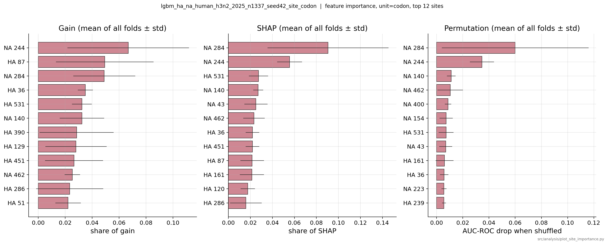
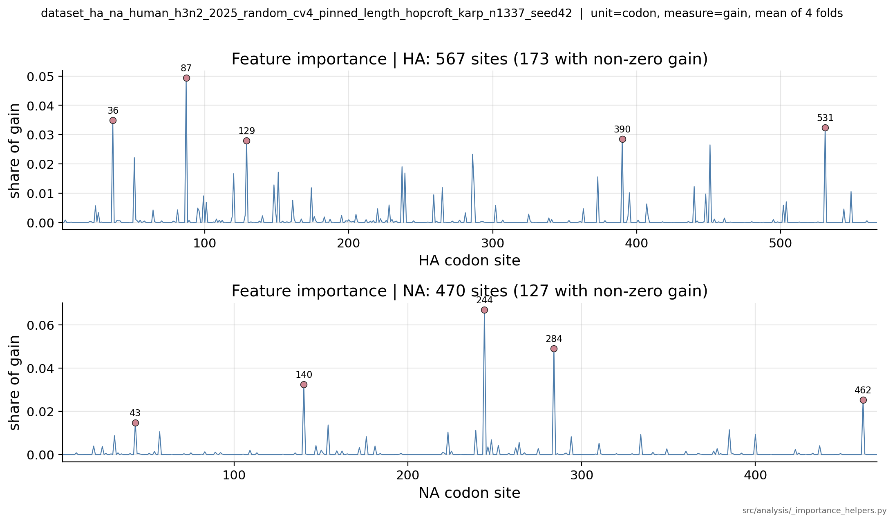
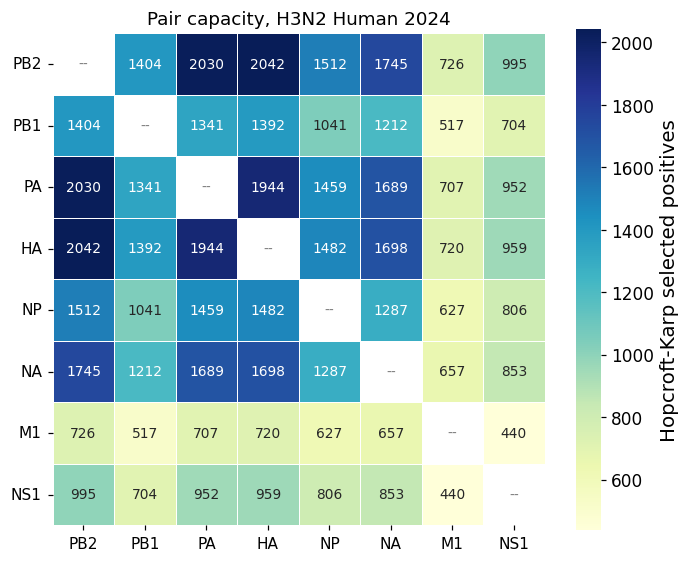
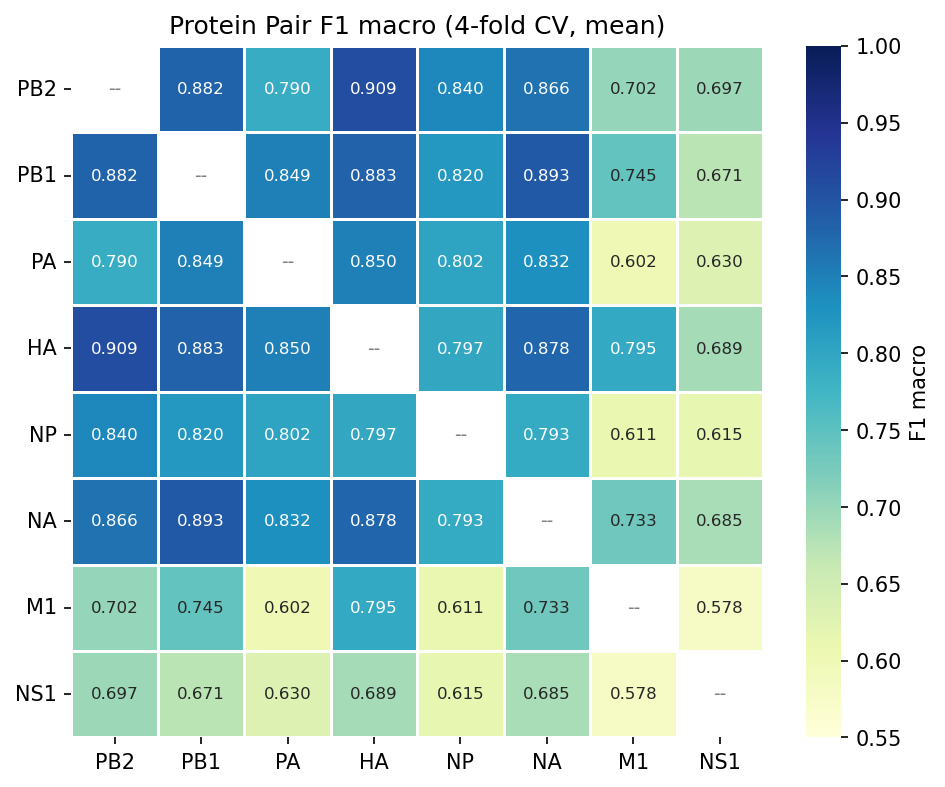

# Cross-year site feature importance, 28-pairs, and aligned CDS features

**Status: IN PROGRESS**

## Goal

Address questions raised following `docs/results/2026-09-08_h3n2_2024_progress_report.md` (focus on Human-H3N2-2024):

1. Do models trained separately on Human-H3N2-2024 and Human-H3N2-2025 rely on similar HA and NA
codon sites?
2. Measure each of the 28 schema pairs *native* `HK selected` positive count in Human-H3N2-2024,
while considering only complete CDS at pinned lengths.
3. Train and evaluate LightGBM for the 28 schema pairs in Human-H3N2-2024, using each pair’s
native `HK selected` positives and a 1:1 ratio of negatives generated within each fold.
4. Do GenSLM embedded codons perform better as features for LightGBM than raw codon features?
5. Can codon-preserving alignment retain complete CDS records at non-pinned lengths while
placing homologous sites in shared coordinates? Alignment cannot recover incomplete records,
so the question is whether the effort is worth it. See `docs/results/2026-09-07_cds_length_survey.md`,
and its "Pin reach by year" section for 2015-2025.

## Scope

- Population (metadata filters): Human-H3N2-2024.
- 8 major Proteins: PB2, PB1, PA, HA, NP, NA, M1, NS1.
- Positive pairs: observed same-isolate pairs, deduplicated by `nt_cds` pair key.
- Positive selection: Hopcroft-Karp, so each retained CDS occurs at most once in each slot.
- Splitting: 4-fold random CV with negatives generated within each fold.
- Features: per-site codons and GenSLM embedded codons. Nucleotide (nt) 6-mers and amino-acids
  (aa) will be added later for the full analysis.
- Feature importance measure: fold-averaged LightGBM gain, SHAP, test set permutation.
- Experiments 1-4 should use the same pin table (below). This keeps the feature dimensions and site indices consistent across runs. It does not establish that corresponding positions are homologous, which needs separate alignment validation or entropy analysis.

| Segment ID | protein | pin (nt) | source |
| --- |---|---:|---|
| 1 | PB2 | 2,280 | `conf/virus/flu.yaml` |
| 2 | PB1 | 2,277 | bundle override |
| 3 | PA | 2,151 | `conf/virus/flu.yaml` |
| 4 | HA | 1,701 | `conf/virus/flu.yaml` |
| 5 | NP | 1,497 | `conf/virus/flu.yaml` |
| 6 | NA | 1,410 | `conf/virus/flu.yaml` |
| 7 | M1 | 759 | `conf/virus/flu.yaml` |
| 8 | NS1 | 693 | bundle override |

Per-site features need one pinned CDS length for each protein. For PB2, PA, HA, NP, NA, and M1,
the same length holds across H3N2 and H1N1. These six pins are stored in `conf/virus/flu.yaml`
and match the most common complete-CDS lengths in Human-H3N2-2024. This experiment adds pins
for PB1 (2,277 nt) and NS1 (693 nt) through a bundle-level `virus.cds_length` override. The
override adds these two values to the six shared pins. PB1 and NS1 are kept out of `conf/virus/flu.yaml`
because that file is shared across influenza A populations. Their Human-H3N2 pins do not apply
to H1N1, where PB1 is typically 2,274 nt and NS1 is 660 nt. Using the Human-H3N2 values for H1N1
would cause check_cds_length to fail. How many isolates each pin retains by year is reported
under “Pin reach by year” in `docs/results/2026-09-07_cds_length_survey.md`.

## Caveats

- For Human-H3N2-2024, only 55.3% of isolates have a complete PB1 (alignment cannot fix that).
See `docs/results/2026-09-07_cds_length_survey.md` section "Results: Human-H3N2-2024".
- From Experiment 2, the `HK selected` positives count ranges 440 to 2,042 across the 28 pairs
for Human-H3N2-2024, with `M1` or `NS1` involved in the lowest counts.

## Existing code

- `src/analysis/aggregate_allpairs_results.py` already builds a 28-pair summary and heatmaps. It should be extended only where the current LightGBM/site-feature outputs require it.
- `src/analysis/summarize_cds_lengths.py` provides the per-protein completeness and length audit. Results in `docs/results/2026-09-07_cds_length_survey.md`.
- `src/analysis/summarize_pair_capacity.py` gives each schema pair its own eligible isolates. Results in `docs/results/2026-09-08_cds_pair_capacity.md`, which is Experiment 2's reference.
- `src/analysis/plot_site_importance.py` writes per-site gain, SHAP, and permutation importance by fold.

## Definitions and interpretation

### Population for a schema pair

Each schema pair is built independently for Human-H3N2-YEAR. An isolate is eligible for a pair if it has both required proteins and complete CDS.

For each schema pair, report these counts in order:

1. eligible isolates
2. unique observed positive pairs after `nt_cds` pair-key deduplication
3. unique slot-A and slot-B sequences
4. positives selected by Hopcroft-Karp (`HK selected`)
5. positives and negatives in each CV fold. This one needs built CV folds, so Experiment 3
   produces it and Experiment 2 does not

### Dataset checks every experiment must pass

- Positive pair keys are unique (no duplicate pairs).
- Every retained CDS is complete and equals its configured pinned length.
- No CDS occurs in more than one CV split within a fold (i.e., each CDS occurs once in a positive pair).
- No generated negative is an observed positive from the pair universe (block conflicting negatives).
- Before Experiment 3 trains, each production dataset reproduces the `Eligible isolates`, `Unique positives`, `Unique slot-A`, `Unique slot-B` and `HK selected` counts its pair has in Experiment 2's `pair_capacity.csv`.
- Where importance is computed, every importance row can be traced to a model run, fold, protein, and site.

### What the model predicts

- The label records whether two segment sequences were observed together in one isolate. Strong performance does not by itself establish biological compatibility. 
- A generated negative is a sequence pair not observed in the pair universe. It is not evidence that the pair is biologically incompatible or could never occur.


## Experiment 1: cross-year HA-NA importance — DONE (2026-09-15)

### Question

Do models trained separately on Human-H3N2-2024 and Human-H3N2-2025 rely on similar HA and NA
codon sites?

### Methods

- For the Human-H3N2-2024 analysis, we used `conf/bundles/flu_ha_na_human_h3n2_2024_random_cv4_pinned_length_hopcroft_karp.yaml` and the saved `resolved_config.yaml` from its earlier codon runs.
- For the Human-H3N2-2025 analysis, we used `conf/bundles/flu_ha_na_human_h3n2_2025_random_cv4_pinned_length_hopcroft_karp.yaml` where only the year is different and otherwise reused the same settings.
- Both analyses kept all their `HK selected` positives: 1,698 in 2024 and 1,337 in 2025 (i.e., we didn't downsample to the same size).
- The July 2025 corpus contains only a partial 2025 season.
- `src/analysis/plot_site_importance.py` computed gain, SHAP, and permutation importance. The cross-year ranking uses fold-averaged, normalized gain. The comparison was run three ways:
  - `combined`: HA and NA compete for the same top-N positions;
  - `HA`: sites are ranked within HA only;
  - `NA`: sites are ranked within NA only.

Both datasets contain complete sequences at the same pins and use the same feature coordinates:
567 HA sites and 470 NA sites.

### Results

The barplots show gain, SHAP, and permutation importance for Human-H3N2-2024 and
Human-H3N2-2025.




The gain traces show where gain falls along HA and NA.




The division of gain between the two proteins changed modestly, while its concentration in the
combined top-25 sites was similar.

| year | gain by protein | gain in combined top-25 sites |
|---|---|---:|
| 2024 | HA 55.5%; NA 44.5% | 59.1% |
| 2025 | HA 60.4%; NA 39.6% | 60.6% |

The two years share 13 of their combined top-25 sites, 15 of the top-25 HA sites, and 13 of the
top-25 NA sites. All three overlaps were much larger than expected under the varying-site null.

The null comparison treats a site as eligible when it has more than one observed value
(`n_values > 1`). If `V_2024` and `V_2025` are the eligible sets, two independent random top-N
lists have expected overlap
`|V_2024 ∩ V_2025| × (N / |V_2024|) × (N / |V_2025|)`.
This is a descriptive baseline, not a significance test: it treats eligible sites as independent
and equally likely to be selected, which is not true for correlated sites. In the combined row
below, `V_2024 ∩ V_2025` is "eligible in both" and each `V` is that year's "eligible" column, so
the expected overlap at N = 25 is `931 × (25/987) × (25/946) = 0.62`.

| ranking | eligible in 2024 | eligible in 2025 | eligible in both | shared top 25 | shared/N | expected | enrichment |
|---|---:|---:|---:|---:|---:|---:|---:|
| combined | 987 | 946 | 931 | 13 | 52% | 0.62 | 20.9x |
| HA | 542 | 519 | 511 | 15 | 60% | 1.14 | 13.2x |
| NA | 445 | 427 | 420 | 13 | 52% | 1.38 | 9.4x |

The complete top-10-to-top-50 comparison is in
`results/flu/July_2025/cross_year_site_importance/ha_na_human_h3n2_2024_vs_2025/site_importance_comparison.csv`.

- The leading sites therefore recur across the two annual fits more often than expected if varying
sites were selected uniformly.
- The comparison does not control for the smaller 2025
population, the partial 2025 season, or correlation among sites.
- `TODO`: repeast similar analysis with SHAP and permutation.


## Experiment 2 (prerequisite to Experiment 3): 28-pair capacity audit — DONE (2026-09-16)

### Question

Measure each of the 28 schema pairs *native* `HK selected` positive count in Human-H3N2-2024,
while considering only complete CDS at pinned lengths.

### Methods

Methods and discussion in `docs/results/2026-09-08_cds_pair_capacity.md`; per-protein
completeness and the length pins in `docs/results/2026-09-07_cds_length_survey.md`.

- Population: Human-H3N2-2024.
- Each pair uses its own eligible isolates. An isolate needs the pair's two
  proteins as a complete CDS at the pinned length.
- The table in Scope shows the length pins.

```
python -m src.analysis.summarize_pair_capacity \
  --config_bundle flu_8_major_proteins_human_h3n2_2024_pinned_length \
  --proteins PB2 PB1 PA HA NP NA M1 NS1 \
  --out_dir results/flu/July_2025/pair_capacity_8_proteins
```

### Results

Transcribed from `docs/results/2026-09-08_cds_pair_capacity.md`.



- `HK share` = `HK selected` / `Unique positives`. It runs from 22.9% (PA-M1) to 59.8% (PB2-PB1, PB1-HA).

| Pair ID | Schema pair | Eligible isolates | Unique positives | Unique slot-A | Unique slot-B | HK selected | HK share |
|---|---|---:|---:|---:|---:|---:|---:|
| 1-2 | PB2-PB1 | 2,945 | 2,349 | 1,788 | 1,790 | 1,404 | 59.8% |
| 1-3 | PB2-PA | 5,324 | 3,837 | 2,808 | 2,712 | 2,030 | 52.9% |
| 1-4 | PB2-HA | 5,329 | 3,796 | 2,810 | 2,681 | 2,042 | 53.8% |
| 1-5 | PB2-NP | 5,318 | 3,484 | 2,800 | 1,830 | 1,512 | 43.4% |
| 1-6 | PB2-NA | 5,167 | 3,532 | 2,745 | 2,203 | 1,745 | 49.4% |
| 1-7 | PB2-M1 | 5,332 | 3,128 | 2,813 | 812 | 726 | 23.2% |
| 1-8 | PB2-NS1 | 5,313 | 3,204 | 2,800 | 1,120 | 995 | 31.1% |
| 2-3 | PB1-PA | 2,939 | 2,332 | 1,786 | 1,710 | 1,341 | 57.5% |
| 2-4 | PB1-HA | 2,945 | 2,327 | 1,790 | 1,756 | 1,392 | 59.8% |
| 2-5 | PB1-NP | 2,942 | 2,162 | 1,787 | 1,227 | 1,041 | 48.1% |
| 2-6 | PB1-NA | 2,939 | 2,237 | 1,786 | 1,480 | 1,212 | 54.2% |
| 2-7 | PB1-M1 | 2,945 | 1,992 | 1,790 | 582 | 517 | 26.0% |
| 2-8 | PB1-NS1 | 2,937 | 2,029 | 1,788 | 781 | 704 | 34.7% |
| 3-4 | PA-HA | 5,329 | 3,805 | 2,711 | 2,682 | 1,944 | 51.1% |
| 3-5 | PA-NP | 5,318 | 3,455 | 2,703 | 1,832 | 1,459 | 42.2% |
| 3-6 | PA-NA | 5,167 | 3,520 | 2,649 | 2,202 | 1,689 | 48.0% |
| 3-7 | PA-M1 | 5,335 | 3,082 | 2,716 | 812 | 707 | 22.9% |
| 3-8 | PA-NS1 | 5,315 | 3,214 | 2,705 | 1,121 | 952 | 29.6% |
| 4-5 | HA-NP | 5,323 | 3,382 | 2,673 | 1,830 | 1,482 | 43.8% |
| 4-6 | HA-NA | 5,173 | 3,466 | 2,634 | 2,203 | 1,698 | 49.0% |
| 4-7 | HA-M1 | 5,338 | 3,018 | 2,686 | 811 | 720 | 23.9% |
| 4-8 | HA-NS1 | 5,318 | 3,151 | 2,676 | 1,119 | 959 | 30.4% |
| 5-6 | NP-NA | 5,162 | 3,091 | 1,794 | 2,197 | 1,287 | 41.6% |
| 5-7 | NP-M1 | 5,326 | 2,356 | 1,833 | 808 | 627 | 26.6% |
| 5-8 | NP-NS1 | 5,307 | 2,540 | 1,824 | 1,114 | 806 | 31.7% |
| 6-7 | NA-M1 | 5,176 | 2,620 | 2,206 | 800 | 657 | 25.1% |
| 6-8 | NA-NS1 | 5,156 | 2,794 | 2,196 | 1,092 | 853 | 30.5% |
| 7-8 | M1-NS1 | 5,323 | 1,840 | 806 | 1,122 | 440 | 23.9% |

What the later experiments need from this:

- **Experiment 3** trains on the `HK selected` column: 440 (M1-NS1) to 2,042 (PB2-HA).
  The 13 pairs containing M1 or NS1 hold the 13 lowest counts (M1 or NS1 supply the fewest unique
  sequences).
- **Experiment 4** runs GenSLM on the same data as Experiment 3 (same
  positives and negatives, sequences and folds). Varying CDS length can be explored later, but it would
  not recover PB1's 44.7%, which stems from incomplete records rather than the pin.
- **Experiment 5** does not draw on this section. It addresses complete CDS at more than one
  length, measured in `docs/results/2026-09-07_cds_length_survey.md`.

#### Decision for Experiments 3 and 4

All 28 schema pairs proceed with their native `HK selected` positives. They are not downsampled to
the M1-NS1 floor of 440.


## Experiment 3: pinned-length 28-pairs screen — DONE (2026-09-20)

### Question

Train and evaluate LightGBM for all 28 schema pairs in Human-H3N2-2024, using each pair’s
native `HK selected` positives and a 1:1 ratio of negatives generated within each fold.

### Methods

- The pinned lengths are listed in Scope above. Each pair uses the `HK selected` positive count from
  Experiment 2. Per-protein CDS completeness is reported in `docs/results/2026-09-07_cds_length_survey.md`
- One dataset per schema pair, built from `conf/bundles/flu_28p_codon_{pair}.yaml`. The 28
  children yaml files inherit the master, `conf/bundles/flu_28p_human_h3n2_2024_site_codon.yaml`,
  and each sets only `schema_pair`, so every pair runs under identical rules: Human-H3N2-2024,
  complete CDS at the pinned length, the `nt_cds` pair key, Hopcroft-Karp to select positives (the
  `HK selected` positives set), random 4-fold CV.
- Each schema pair uses its native `HK selected` positives, ranging from 440 for M1-NS1 to 2,042 for
  PB2-HA (i.e., datasets are not downsampled to a common size, as decided at the end of Experiment 2).
- The negatives are drawn within each fold at a 1:1 ratio, so each test fold is balanced.
- The model is LightGBM at a 0.5 threshold (raw test predictions are saved).
- With balanced test folds, a classifier predicting each class randomly has expected F1 macro near 0.5.
- Features are one ordinal column per codon position, for both slots concatenated. The width is
  the sum of the two proteins' codon counts (484 for M1-NS1 to 1,519 for PB2-PB1).
- Before training, all 28 datasets reproduced their `Eligible isolates`, `Unique positives`,
  `Unique slot-A`, `Unique slot-B` and `HK selected` counts from Experiment 2's
  `pair_capacity.csv`, as required by "Dataset checks every experiment must pass"
  (`src/analysis/audit_pair_datasets.py`, 28 passed, 0 failed).
- 112 models trained (28 pairs x 4 folds).

```
python scripts/run_allpairs_baselines.py \
  --bundle_prefix flu_28p_codon_ --dataset_prefix exp3_28p_codon_ \
  --baseline lgbm --cv_dir_bundle 'flu_28p_{pair}_codon'

python -m src.analysis.aggregate_allpairs_results --tag codon \
  --timestamp 20260919_225844 \
  --output_dir results/flu/July_2025/all_pairs_human_h3n2_2024_codon
```

### Results



- Mean ± STD across 4 folds.
- Pairs are ranked by mean F1 macro.
- All the scores are in
  `results/flu/July_2025/all_pairs_human_h3n2_2024_codon/allpairs_summary.csv`.


| Rank | Schema pair | HK selected | Features | F1 macro | AUC-ROC | Precision | Recall |
|---:|---|---:|---:|---:|---:|---:|---:|
| 1 | PB2-HA | 2,042 | 1,327 | 0.909 ± 0.006 | 0.952 ± 0.007 | 0.871 ± 0.013 | 0.961 ± 0.007 |
| 2 | PB1-NA | 1,212 | 1,229 | 0.893 ± 0.014 | 0.933 ± 0.010 | 0.852 ± 0.023 | 0.954 ± 0.009 |
| 3 | PB1-HA | 1,392 | 1,326 | 0.883 ± 0.020 | 0.943 ± 0.009 | 0.840 ± 0.021 | 0.949 ± 0.024 |
| 4 | PB2-PB1 | 1,404 | 1,519 | 0.882 ± 0.030 | 0.940 ± 0.017 | 0.834 ± 0.039 | 0.957 ± 0.007 |
| 5 | HA-NA | 1,698 | 1,037 | 0.878 ± 0.013 | 0.935 ± 0.007 | 0.829 ± 0.015 | 0.954 ± 0.015 |
| 6 | PB2-NA | 1,745 | 1,230 | 0.866 ± 0.018 | 0.923 ± 0.010 | 0.814 ± 0.018 | 0.950 ± 0.017 |
| 7 | PA-HA | 1,944 | 1,284 | 0.850 ± 0.019 | 0.927 ± 0.009 | 0.805 ± 0.024 | 0.927 ± 0.008 |
| 8 | PB1-PA | 1,341 | 1,476 | 0.849 ± 0.019 | 0.922 ± 0.007 | 0.803 ± 0.022 | 0.929 ± 0.009 |
| 9 | PB2-NP | 1,512 | 1,259 | 0.840 ± 0.014 | 0.917 ± 0.012 | 0.783 ± 0.016 | 0.946 ± 0.010 |
| 10 | PA-NA | 1,689 | 1,187 | 0.832 ± 0.009 | 0.909 ± 0.007 | 0.786 ± 0.015 | 0.916 ± 0.011 |
| 11 | PB1-NP | 1,041 | 1,258 | 0.820 ± 0.021 | 0.904 ± 0.014 | 0.764 ± 0.021 | 0.933 ± 0.011 |
| 12 | PA-NP | 1,459 | 1,216 | 0.802 ± 0.034 | 0.884 ± 0.033 | 0.753 ± 0.035 | 0.908 ± 0.011 |
| 13 | HA-NP | 1,482 | 1,066 | 0.797 ± 0.056 | 0.887 ± 0.041 | 0.750 ± 0.059 | 0.909 ± 0.016 |
| 14 | HA-M1 | 720 | 820 | 0.795 ± 0.022 | 0.855 ± 0.021 | 0.750 ± 0.019 | 0.892 ± 0.054 |
| 15 | NP-NA | 1,287 | 969 | 0.793 ± 0.007 | 0.882 ± 0.004 | 0.739 ± 0.006 | 0.915 ± 0.015 |
| 16 | PB2-PA | 2,030 | 1,477 | 0.790 ± 0.046 | 0.876 ± 0.039 | 0.749 ± 0.041 | 0.878 ± 0.052 |
| 17 | PB1-M1 | 517 | 1,012 | 0.745 ± 0.089 | 0.816 ± 0.051 | 0.697 ± 0.073 | 0.928 ± 0.043 |
| 18 | NA-M1 | 657 | 723 | 0.733 ± 0.043 | 0.801 ± 0.043 | 0.683 ± 0.036 | 0.901 ± 0.020 |
| 19 | PB2-M1 | 726 | 1,013 | 0.702 ± 0.026 | 0.775 ± 0.037 | 0.671 ± 0.027 | 0.810 ± 0.024 |
| 20 | PB2-NS1 | 995 | 991 | 0.697 ± 0.038 | 0.777 ± 0.035 | 0.660 ± 0.032 | 0.842 ± 0.043 |
| 21 | HA-NS1 | 959 | 798 | 0.689 ± 0.052 | 0.772 ± 0.069 | 0.655 ± 0.044 | 0.843 ± 0.016 |
| 22 | NA-NS1 | 853 | 701 | 0.685 ± 0.062 | 0.763 ± 0.071 | 0.648 ± 0.045 | 0.857 ± 0.095 |
| 23 | PB1-NS1 | 704 | 990 | 0.671 ± 0.048 | 0.745 ± 0.066 | 0.639 ± 0.040 | 0.827 ± 0.023 |
| 24 | PA-NS1 | 952 | 948 | 0.630 ± 0.064 | 0.700 ± 0.071 | 0.612 ± 0.060 | 0.800 ± 0.026 |
| 25 | NP-NS1 | 806 | 730 | 0.615 ± 0.051 | 0.681 ± 0.060 | 0.597 ± 0.040 | 0.811 ± 0.031 |
| 26 | NP-M1 | 627 | 752 | 0.611 ± 0.033 | 0.696 ± 0.034 | 0.594 ± 0.024 | 0.817 ± 0.048 |
| 27 | PA-M1 | 707 | 970 | 0.602 ± 0.053 | 0.675 ± 0.058 | 0.588 ± 0.042 | 0.779 ± 0.023 |
| 28 | M1-NS1 | 440 | 484 | 0.578 ± 0.061 | 0.676 ± 0.060 | 0.576 ± 0.037 | 0.880 ± 0.057 |


- F1 macro ranges [0.578, 0.909], with a median of 0.794. All pairs score above 0.5.
- Across the 28 pairs, F1 macro correlates with `HK selected` at $\rho$=0.757 and with feature width at $\rho$=0.801 ($\rho$: Spearman correlation).
- The 13 pairs containing M1 or NS1 have the smallest `HK selected`; 12 of them also have the lowest F1 scores.
- When considering the other 15 pairs, the correlations are much weaker: $\rho$=0.071 with `HK selected` and $\rho$=0.304 with feature width. So the >0.75 correlations between F1 and {`HK selected`, feature width} are driven by the 13 pairs containing M1 or NS1.
- The pairs differ in several ways, so these correlation results do not establish that either `HK selected` or feature width limits performance.
- Recall > Precision in all 28 pairs, so the model over-predicts the positive class at
  0.5 threshold.

Reproducibility:
- HA-NA reproduces the earlier standalone run. All 4 of test set prediction
  files match value for value, although the two runs used different bundles and different dataset
  dirs. This confirms reproducibility for HA-NA at a fixed seed (reported in
  `docs/results/2026-09-08_h3n2_2024_progress_report.md`).
- The other 3 pairs in that report were downsampled to 1,698 positives, so their codon rows
  are not comparable to the counts used here.

Limitations:

- One population: Human-H3N2-2024.
- Only 4 CV folds.
- The datasets across the schema pairs do not necessarily share the same isolates.

What the later experiments need from this:

- **Experiment 4** compares GenSLM codon embeddings with per-site codon features. For each schema pair included in Experiment 4, both feature types should use the same dataset whenever possible, and their F1 macro scores should be compared.
- **Experiment 5** does not draw on this section.


## Experiment 4: GenSLM embedded codons as features for LightGBM

### Question

Do GenSLM embedded codons perform better as features for LightGBM than raw codon features?

### Methods

GenSLM embeddings are also a route to sequences of varying length, since they do not need one
column per pinned position. This experiment holds the length pinned and changes only the feature
representation; varying length is a later question.

1. Compute and cache GenSLM embeddings for all unique complete CDS codons.
2. Start with CV training on HA-NA, Human-H3N2-2024. Reuse Experiment 3's built dataset rather
   than rebuilding it, so the 1,698 `HK selected` positives and the 4 fold assignments are
   identical and the only difference from the raw-codon run is the feature representation.
3. Expand to the 4 schema pairs as in 2026-09-08_h3n2_2024_progress_report.md: HA-NA, PB2-PA,
   PB2-NA, PA-HA, reusing Experiment 3's datasets for each.
4. Optional. All 28 pairs, again on Experiment 3's datasets.

### Results

1. Generate a table similar to the table under Results in 2026-09-08_h3n2_2024_progress_report.md,
   with the same columns and one row per pair per feature type, so GenSLM sits beside the
   per-site codon scores from Experiment 3.

2. If step 4 runs, plot the symmetric 8 x 8 F1 macro heatmap, as in Experiment 3.


## Experiment 5: codon-preserving alignment pilot

### Question

Does alignment add enough valid site-feature data to justify new production-pipeline support?

### Methods

#### Aligned site features

Aligned site features assign one feature column to each homologous alignment position. The alternative they are measured against is pinned-length site features, the current production method; see "Per-site features" and "Pinned CDS length" in `docs/methods/glossary.md`. Coding sequences must be aligned in a way that preserves the reading frame. The proposed pilot translates each CDS, aligns the proteins, and projects protein gaps back to codon triplets. An unrestricted nucleotide alignment is not acceptable because it can introduce frame-breaking gaps.

An alignment gap, an unknown base, and unobserved sequence are different states:

- a gap represents an inferred biological insertion or deletion relative to other sequences;
- an unknown base is present in the record but unresolved;
- unobserved sequence is absent because the assembly or CDS is truncated.

These states must not be encoded as the same category. In particular, a truncated PB1 record must not be presented as evidence of a biological deletion.

#### Audit before alignment

Seven of the eight proteins already have a modal complete-CDS length that does not change across
Human-H3N2 2015-2025, so this audit reduces to PB1. In Human-H3N2-2024 itself no pair needs aligned
rather than pinned-length coordinates: the lowest `frac at mode` among complete CDS is NS1 at 0.991
and PB1 at 0.994, and PB1's remaining loss is incompleteness, which alignment cannot reconstruct.
Extend the length survey by protein and year for 2023-2025 to confirm that, then, for every
non-modal length, separate:

1. complete CDS records with plausible biological insertions or deletions;
2. incomplete CDS records caused by missing start or stop sequence;
3. records with internal stops or unresolved bases;
4. possible annotation inconsistencies.

Report both isolates and unique CDS sequences. Alignment can place complete biological length
variants into a common coordinate system. It cannot recover unsequenced bases, improve assembly
completeness, or create new sequence diversity.

#### Pilot proteins

Pilot the method on PB1 and NS1. PB1's modal complete-CDS length moves across the years of
interest, from 2,274 nt through 2023 to 2,277 nt in 2024-2025. NS1 holds one mode of 693 nt
throughout, but carries enough other complete lengths to drop retention to 0.723 in 2019 and 0.688
in 2020. Use PB2-PB1 as the first paired modeling case if PB1 passes alignment validation; PB2
supplies a stable partner and the pair has a direct polymerase interpretation. Keep the existing
pinned-length population as the control.

#### Alignment method

Prototype the alignment outside the dataset builder first:

1. translate each complete CDS using the current translation rules;
2. align aa sequences with a reproducible tool and version. MAFFT and pyFAMSA
   (https://github.com/althonos/pyfamsa) are the progressive-aligner candidates. pyHMMER
   (https://github.com/althonos/pyhmmer) is a separate option if a profile-HMM alignment, which
   gives a column space that does not shift as sequences are added, is under consideration;
3. project each aa gap back to a three-nucleotide codon gap;
4. retain an explicit mapping from alignment column to original residue/codon coordinate;
5. encode gaps, unknown residues, and missing sequence separately;
6. record the exact input sequence hashes and alignment command.

Do not add general alignment knobs to the production pipeline until the pilot passes its checks and
shows a useful increase in eligible data.

#### Validation

- Removing alignment gaps reproduces the original input sequence exactly.
- Every inserted CDS gap has a length divisible by three.
- Translating the ungapped aligned CDS reproduces the original protein.
- The procedure introduces no internal stop codons.
- Known PB1 and NS1 length forms align to plausible terminal or internal locations rather than
  being spread across many arbitrary gaps.
- Repeated runs with the same inputs and tool version produce identical coordinates.
- Gap-heavy and missing-heavy columns are reported and can be excluded in a sensitivity analysis.

For a descriptive comparison across years, a pooled 2023-2025 alignment may be used if it is
labeled as pooled. For a prospective train-on-year-T, test-on-year-T+1 experiment, test-year
sequences must not determine the training feature coordinates. That setting needs a training-only
reference/profile and a documented rule for insertions not represented in the training alignment.

### Results

1. The PB1 length audit by year, splitting every non-modal length into the four categories above.
2. The prototype alignment and its outcome on each validation check.
3. A PB2-PB1 comparison of aligned against pinned-length features, if PB1 passes validation.

#### Decision gate

Promote aligned features into the dataset pipeline only if:

- the validation checks pass;
- alignment retains a meaningful number of complete sequences or enables a previously excluded
  protein/year comparison;
- the added columns have a stable biological interpretation;
- conclusions are not driven only by gap or missingness indicators.

PB1 records truncated before the terminal stop remain excluded from the primary analysis even if
they can be padded. They may be examined only in a clearly labeled missing-data sensitivity arm.

## Execution order

1. Build and audit the pinned-length 2024 and 2025 HA-NA datasets. (Experiment 1, DONE)
2. Run the codon cross-year importance comparison. (Experiment 1, DONE)
3. Produce the 2024 eight-protein, 28-pair capacity audit. (Experiment 2, DONE)
4. Build and audit the 28 pinned-length datasets. (Experiment 3, DONE)
5. Run the codon 28-pairs screen and aggregate the results. (Experiment 3, DONE)
6. Cache the GenSLM codon embeddings, then compare them against raw codon features on HA-NA and
   on the four progress-report pairs. (Experiment 4)
7. Complete the PB1/NS1 alignment feasibility audit and prototype. (Experiment 5)
8. Rerun only the pairs or years for which alignment materially improves eligibility.
   (Experiment 5)
9. Decide whether the evidence supports a publication scope, a narrower follow-up, or an archived
   negative/benchmark result.

Steps 4-6 do not depend on the alignment pilot.

## Reproducibility and reporting

Every dataset and model run must record:

- input corpus version and git commit;
- metadata filters;
- CDS completeness and coordinate rules;
- pair-key alphabet and the pair universe used to block negatives;
- positive-selection method and seed;
- fold assignments and `negative_scope`;
- feature representation and alignment version, if used;
- model configuration and output paths.

Keep per-fold data. Do not report only means. Any strict held-out perturbation or masking analysis
must derive its site ranking inside each training fold; a ranking averaged over all folds is
descriptive and must not be used to select features for that same held-out data.

The final report should contain:

1. cross-year HA and NA importance comparisons;
2. the 28-pair capacity and performance matrices;
3. a direct statement of which pairs fail or weaken;
4. GenSLM embedded codons against raw codon features, on the pairs it was run on;
5. the alignment yield and validation results;
6. limitations from sampling, partial 2025 coverage, correlated sites, and metadata shortcuts;
7. a recommendation to continue, narrow the scope, or archive the project.

## Planned code and artifacts

Names are provisional until implementation begins.

| item | purpose |
|---|---|
| `src/analysis/compare_site_importance_across_years.py` | compare annual per-fold importance tables and produce shared-coordinate plots |
| `src/analysis/summarize_pair_capacity.py` | decide eligibility per schema pair rather than over one shared set of isolates |
| `src/analysis/aggregate_allpairs_results.py` | report F1 macro and AUC-PR alongside the existing metrics, and plot an F1 macro heatmap |
| `scripts/run_allpairs_baselines.py` | train a baseline over every fold of a set of built pair datasets, and aggregate each pair |
| `src/preprocess/align_cds_by_protein.py` | alignment pilot; added only after its input/output contract is fixed |
| `results/flu/July_2025/cross_year_site_importance/` | cross-year tables, audits, and figures |
| `results/flu/July_2025/pair_capacity_8_proteins/` | 28-pair capacity audit |
| `results/flu/July_2025/all_pairs_human_h3n2_2024_codon/` | 28-pairs codon summaries and figures |
| `results/flu/July_2025/cds_alignment_pilot/` | alignment audit, mappings, and validation results |

