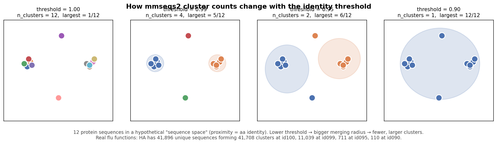
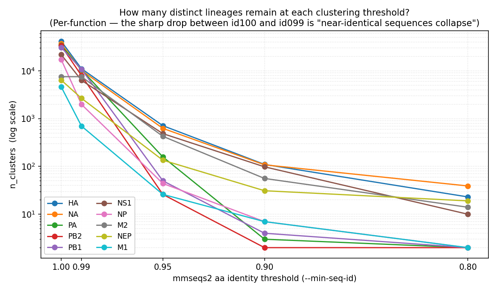
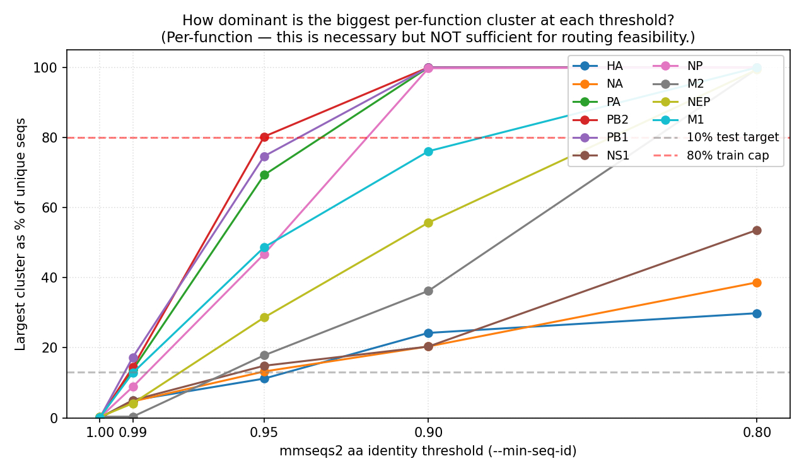
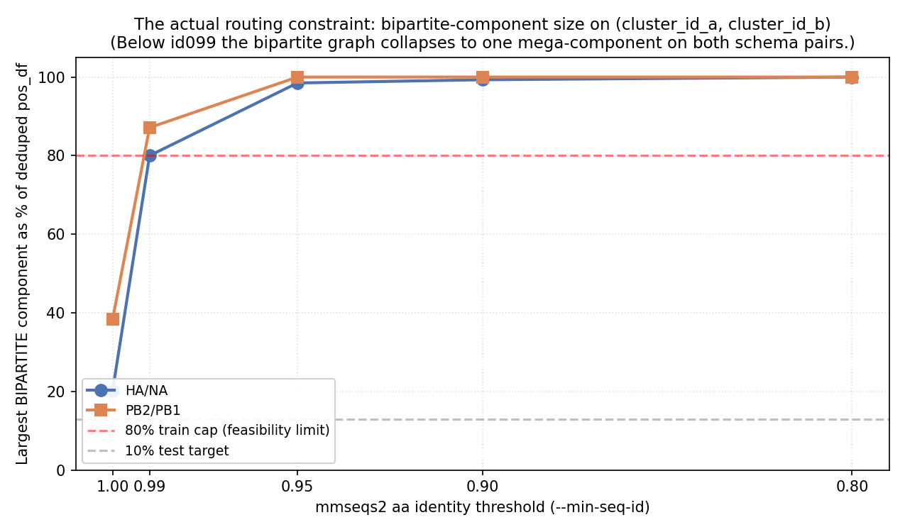

# Protein redundancy per function — mmseqs2 sweep

**Date.** 2026-05-14.
**Input.** `data/processed/flu/July_2025/protein_final.parquet`.
**Tool.** mmseqs2 `easy-cluster --min-seq-id <th> -c 0.8 --cov-mode 0`.
**Script.** `src/analysis/protein_redundancy_per_function.py`.

## Visual primer — what the columns mean

Each row in the tables below summarizes the **cluster-size distribution
that mmseqs2 produces for a given function at a given threshold**. The
threshold (`--min-seq-id`) is the **minimum aa identity** required between
two sequences to be in the same cluster (combined with `-c 0.8` minimum
alignment coverage). Lower threshold = bigger merging radius = fewer,
larger clusters.

Reading the columns:

- **`n_sequences`** — number of **unique** protein sequences input to
  mmseqs for this function. Constant across thresholds (the input
  doesn't change, only how it's grouped).
- **`n_clusters`** — number of **groups** produced at this threshold.
  At id100 (≈ strict identity), each unique sequence is its own group, so
  `n_clusters ≈ n_sequences`. As the threshold drops, sequences merge,
  so `n_clusters` shrinks.
- **`largest_cluster`** — size (in number of sequences) of the largest
  group. Goes UP as threshold drops because near-identical sequences fold
  into the dominant clade(s).
- **`median_cluster_size`** — half the clusters are smaller than this,
  half larger. Starts at 1 (most clusters are singletons at id100) and
  grows.
- **`p90_cluster_size`** / **`p99_cluster_size`** — 90th / 99th
  percentile of cluster sizes. Useful for seeing the heavy tail.
- **`fraction_singletons`** — fraction of clusters that contain exactly
  1 sequence (sequences with no near-neighbor in the dataset at this
  threshold). High at strict thresholds; collapses to 0 at lax ones.

The two figures below show the empirical trends across thresholds for
each of the major flu functions.

**Reading these together:**
- HA/NA have the **most diversity**: even at id095 they keep hundreds of
  clusters with the largest at 11-13% of unique seqs.
- The polymerase subunits (PB2, PB1, PA) are **highly conserved**: at id095
  the largest cluster already covers 70–80% of unique seqs; at id090 a
  single cluster owns 99.99% of seqs.
- M1, NP behave similarly to the polymerase subunits — they're conserved
  housekeeping proteins.
- M2 and NEP have intermediate behavior — they stay reasonably diverse
  through id095 but collapse by id080.

## Method

For each major protein function, dedup `prot_seq` on md5(`prot_seq.rstrip('*')`), export to FASTA, and cluster at multiple aa-identity thresholds with mmseqs2 `easy-cluster`. `X` residues are left in place (mmseqs handles them natively); internal `*` rows would be dropped but none exist in this corpus.

## Results — cluster-size distribution per (function, threshold)

### threshold = 0.80

| function_short | n_sequences | n_clusters | largest_cluster | p99_cluster_size | p90_cluster_size | median_cluster_size | fraction_singletons |
|---:|---:|---:|---:|---:|---:|---:|---:|
| HA | 41,896 | 23 | 12,513 | 11,984 | 3,921 | 690 | 0.043 |
| M1 | 4,771 | 2 | 4,770 | 4,722 | 4,293 | 2,385 | 0.500 |
| M2 | 8,173 | 14 | 8,137 | 7,080 | 10 | 1 | 0.571 |
| NA | 37,488 | 39 | 14,495 | 13,875 | 1,161 | 95 | 0.179 |
| NEP | 6,896 | 19 | 6,853 | 5,621 | 9 | 1 | 0.632 |
| NP | 17,684 | 2 | 17,683 | 17,506 | 15,914 | 8,842 | 0.500 |
| NS1 | 22,225 | 10 | 11,915 | 11,265 | 5,415 | 61 | 0.100 |
| PA | 34,217 | 2 | 34,216 | 33,873 | 30,794 | 17,108 | 0.500 |
| PB1 | 31,226 | 2 | 31,225 | 30,912 | 28,102 | 15,613 | 0.500 |
| PB2 | 33,663 | 2 | 33,662 | 33,325 | 30,295 | 16,831 | 0.500 |

### threshold = 0.90

| function_short | n_sequences | n_clusters | largest_cluster | p99_cluster_size | p90_cluster_size | median_cluster_size | fraction_singletons |
|---:|---:|---:|---:|---:|---:|---:|---:|
| HA | 41,896 | 110 | 10,159 | 7,484 | 753 | 25 | 0.082 |
| M1 | 4,771 | 7 | 3,630 | 3,468 | 2,017 | 60 | 0.286 |
| M2 | 8,173 | 56 | 2,962 | 2,374 | 225 | 2 | 0.393 |
| NA | 37,488 | 108 | 7,643 | 6,700 | 808 | 24 | 0.157 |
| NEP | 6,896 | 31 | 3,842 | 3,328 | 302 | 1 | 0.516 |
| NP | 17,684 | 7 | 17,643 | 16,586 | 7,075 | 2 | 0.429 |
| NS1 | 22,225 | 98 | 4,523 | 3,827 | 186 | 5 | 0.163 |
| PA | 34,217 | 3 | 34,214 | 33,529 | 27,371 | 2 | 0.333 |
| PB1 | 31,226 | 4 | 31,223 | 30,286 | 21,856 | 1 | 0.750 |
| PB2 | 33,663 | 2 | 33,662 | 33,325 | 30,295 | 16,831 | 0.500 |

### threshold = 0.95

| function_short | n_sequences | n_clusters | largest_cluster | p99_cluster_size | p90_cluster_size | median_cluster_size | fraction_singletons |
|---:|---:|---:|---:|---:|---:|---:|---:|
| HA | 41,896 | 711 | 4,695 | 1,098 | 90 | 3 | 0.370 |
| M1 | 4,771 | 26 | 2,323 | 2,088 | 380 | 1 | 0.500 |
| M2 | 8,173 | 426 | 1,459 | 229 | 21 | 2 | 0.413 |
| NA | 37,488 | 625 | 4,964 | 914 | 92 | 4 | 0.302 |
| NEP | 6,896 | 135 | 1,976 | 1,067 | 43 | 3 | 0.326 |
| NP | 17,684 | 44 | 8,270 | 7,135 | 172 | 4 | 0.341 |
| NS1 | 22,225 | 485 | 3,306 | 1,036 | 51 | 2 | 0.392 |
| PA | 34,217 | 158 | 23,718 | 4,086 | 4 | 1 | 0.759 |
| PB1 | 31,226 | 50 | 23,316 | 15,120 | 75 | 1 | 0.700 |
| PB2 | 33,663 | 26 | 27,019 | 21,790 | 233 | 1 | 0.577 |

### threshold = 0.99

| function_short | n_sequences | n_clusters | largest_cluster | p99_cluster_size | p90_cluster_size | median_cluster_size | fraction_singletons |
|---:|---:|---:|---:|---:|---:|---:|---:|
| HA | 41,896 | 11,039 | 2,089 | 35 | 4 | 1 | 0.753 |
| M1 | 4,771 | 698 | 613 | 133 | 6 | 1 | 0.658 |
| M2 | 8,173 | 7,525 | 28 | 3 | 1 | 1 | 0.954 |
| NA | 37,488 | 10,184 | 1,761 | 31 | 4 | 1 | 0.720 |
| NEP | 6,896 | 2,662 | 286 | 22 | 4 | 1 | 0.716 |
| NP | 17,684 | 1,981 | 1,568 | 111 | 10 | 1 | 0.529 |
| NS1 | 22,225 | 6,313 | 1,122 | 32 | 4 | 1 | 0.657 |
| PA | 34,217 | 10,450 | 4,697 | 8 | 1 | 1 | 0.955 |
| PB1 | 31,226 | 10,782 | 5,393 | 6 | 1 | 1 | 0.962 |
| PB2 | 33,663 | 7,935 | 4,857 | 14 | 1 | 1 | 0.942 |

### threshold = 1.00

| function_short | n_sequences | n_clusters | largest_cluster | p99_cluster_size | p90_cluster_size | median_cluster_size | fraction_singletons |
|---:|---:|---:|---:|---:|---:|---:|---:|
| HA | 41,896 | 41,708 | 6 | 1 | 1 | 1 | 0.996 |
| M1 | 4,771 | 4,633 | 9 | 2 | 1 | 1 | 0.983 |
| M2 | 8,173 | 7,525 | 28 | 3 | 1 | 1 | 0.954 |
| NA | 37,488 | 37,102 | 22 | 1 | 1 | 1 | 0.992 |
| NEP | 6,896 | 6,405 | 20 | 2 | 1 | 1 | 0.954 |
| NP | 17,684 | 17,258 | 17 | 2 | 1 | 1 | 0.985 |
| NS1 | 22,225 | 21,864 | 13 | 1 | 1 | 1 | 0.991 |
| PA | 34,217 | 34,153 | 4 | 1 | 1 | 1 | 0.998 |
| PB1 | 31,226 | 30,808 | 20 | 2 | 1 | 1 | 0.988 |
| PB2 | 33,663 | 33,573 | 17 | 1 | 1 | 1 | 0.998 |

## Reading the table

- `n_sequences`: unique protein sequences input to clustering (constant across thresholds for a given function).
- `n_clusters`: clusters produced at this threshold. Smaller = more aggressive collapse.
- `largest_cluster`: dominant cluster size. If this exceeds the max per-split capacity (10% of n_pairs at 80/10/10), the routing is forced.
- `fraction_singletons`: clusters of size 1 / total clusters. Higher = more sequences with no near-neighbor.

## Feasibility for cluster_disjoint routing

**Per-function cluster sizes are NECESSARY but NOT SUFFICIENT for predicting
cluster_disjoint feasibility.** What actually matters is the **bipartite
component size on (cluster_id_a, cluster_id_b) after dedup of pair_keys** —
because slot-a clusters connect to slot-b clusters via isolates that have both
proteins. See `2026-05-14_cluster_disjoint_feasibility_{ha_na,pb2_pb1}.csv` and
the script `src/analysis/cluster_disjoint_feasibility.py` for the pre-flight check.

### Bipartite-component feasibility (the actual routing constraint)

For each schema pair × threshold, the table below shows the **largest
bipartite-component pct** on the deduped pos_df that Stage 3 routes.
"FEASIBLE" means the partition can mechanically achieve close to 80/10/10
under LPT bin-packing; "DEGENERATE" means one mega-component covers >80%
of pairs and the partition will be heavily skewed toward train.

| schema_pair | id100 | id099 | id095 | id090 | id080 |
|---|---|---|---|---|---|
| HA/NA   | 20.2% FEASIBLE | 80.0% FEASIBLE | 98.5% degenerate | 99.3% degenerate | 100% degenerate |
| PB2/PB1 | 38.4% FEASIBLE | 87.1% degenerate | 100% degenerate  | 100% degenerate  | 100% degenerate |

The plot makes the collapse visually clear: at id100 both schema pairs
sit safely below the 80% train cap (HA/NA ~20%, PB2/PB1 ~38%); at id099
they jump to 80% and 87% respectively (HA/NA right at the limit, PB2/PB1
already over); below id099 both go to ~99-100%. Compare to the per-function
plot above — at id095 HA still has 711 distinct clusters and the largest
is "only" 11% of unique HA sequences, but once HA pairs with NA in routing,
the dominant HA cluster and dominant NA cluster glue together via shared
isolates into one 98.5%-of-pairs bipartite component.

Only **HA/NA at id099** is a non-trivial cluster_disjoint test that the
flu A corpus supports. At id099, PB2/PB1 is already over the 80% threshold
(largest = 87.1%) — Stage 3 will still produce a usable split (~87/6.5/6.5
under LPT) but train will be over-represented.

### Why the bipartite graph collapses so fast

Flu A is dominated by a few major subtypes (H1N1, H3N2, ...). Within each
subtype, both HA and NA are highly conserved across thousands of isolates.
Even at id099 (1% drift), many H1N1 HA proteins cluster together and many
H1N1 NA proteins cluster together, then those two large clusters are
connected via the thousands of H1N1 isolates that contain both → one
giant bipartite component representing "all of H1N1 HA/NA pairs." A second
mega-component captures "all of H3N2." Below id099, these merge into a
single bipartite component that's effectively the whole corpus.

This is a fundamental property of the population structure, not a flaw in
mmseqs or in the routing algorithm. Per-function cluster counts (above) only
constrain the routing in the marginal case; the bipartite structure is the
binding constraint.

### Per-function cluster sizes — for reference only

The per-function tables below remain useful for understanding **how much
similarity the corpus contains** at each threshold — but cluster_disjoint
feasibility is decided by the bipartite table above, not by these numbers.

The original criterion was "largest cluster < 13% of unique seqs" — for
HA at id095 that's true (11.2%). But once HA pairs with NA in routing,
the bipartite component spans many HA clusters glued together by NA
neighbors and vice versa, so the criterion is not load-bearing.

Per-function summary (`largest_cluster` / `n_sequences`):

| function | id100 | id099 | id095 | id090 | id080 |
|---|---:|---:|---:|---:|---:|
| HA  | 0.0% | 5.0% | **11.2%** | **24.2%** | **29.9%** |
| NA  | 0.1% | 4.7% | **13.2%** | **20.4%** | **38.7%** |
| PB2 | 0.1% | 14.4% | **80.3%** ⚠ | **99.99%** ✗ | **99.99%** ✗ |
| PB1 | 0.1% | 17.3% | **74.7%** ⚠ | **99.99%** ✗ | **99.99%** ✗ |
| PA  | 0.0% | 13.7% | **69.3%** ⚠ | **99.99%** ✗ | **99.99%** ✗ |
| NP  | 0.1% | 8.9% | **46.8%** | **99.77%** ✗ | **99.99%** ✗ |
| M1  | 0.2% | 12.8% | **48.7%** | **76.1%** ⚠ | **99.98%** ✗ |
| M2  | 0.3% | 0.3% | 17.9% | **36.2%** | **99.6%** ✗ |
| NEP | 0.3% | 4.1% | **28.7%** | **55.7%** ⚠ | **99.4%** ✗ |
| NS1 | 0.1% | 5.0% | **14.9%** | **20.4%** | **53.6%** ⚠ |

Legend: bold = cluster larger than test target (13%); ⚠ = constrains
routing significantly (≥ 50%); ✗ = trivial partition (≥ 99%, single
dominant cluster).

**Recommended sweep thresholds (revised after bipartite analysis):**

| schema_pair | id100 | id099 | id095 | id090 | id080 |
|---|---|---|---|---|---|
| HA + NA      | yes (≈ seq_disjoint) | **yes** | no — bipartite mega-component | no | no |
| PB2 + PB1    | yes (≈ seq_disjoint) | marginal (87%-degenerate) | no | no | no |

Below id099 the bipartite graph collapses to a single mega-component for
both schema pairs. The only non-trivial cluster_disjoint comparison flu A
supports is **HA/NA at id099** (largest bipartite-component = 80%, just
inside the train target). PB2/PB1 at id099 is borderline (largest = 87%);
it produces a usable train-heavy split that still tests the hypothesis,
but the val/test sizes shrink.

## Notes on the id100 row

At 100% identity with `-c 0.8`, mmseqs2 still merges a small number of
sequences (collapse ratio 1.00-1.09 depending on function). This reflects
sequences that are 100% identical over an aligned region but differ in
length — e.g., a 100-aa protein and a 200-aa extension of it that share
all 100 aligned residues. To get strict identity-disjointness, run with
`-c 1.0` instead. For our purposes the small collapse is acceptable;
id100 cluster_disjoint will behave very similarly to `seq_disjoint`.

## Related

- `docs/plans/2026-05-08_cosine_and_cluster_splits_plan.md` — parent plan (Experiment B).
- `docs/results/2026-05-13_aa_vs_nt_similarity_leakage.md` — the diagnostic that motivated this sweep.
