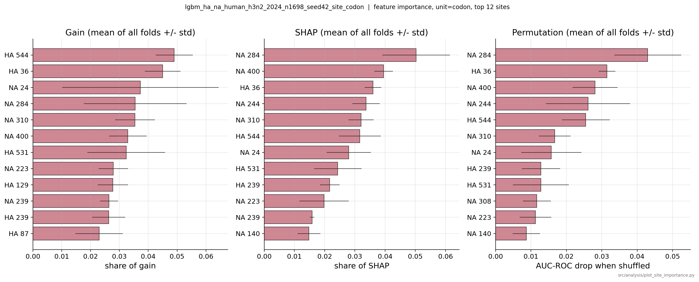
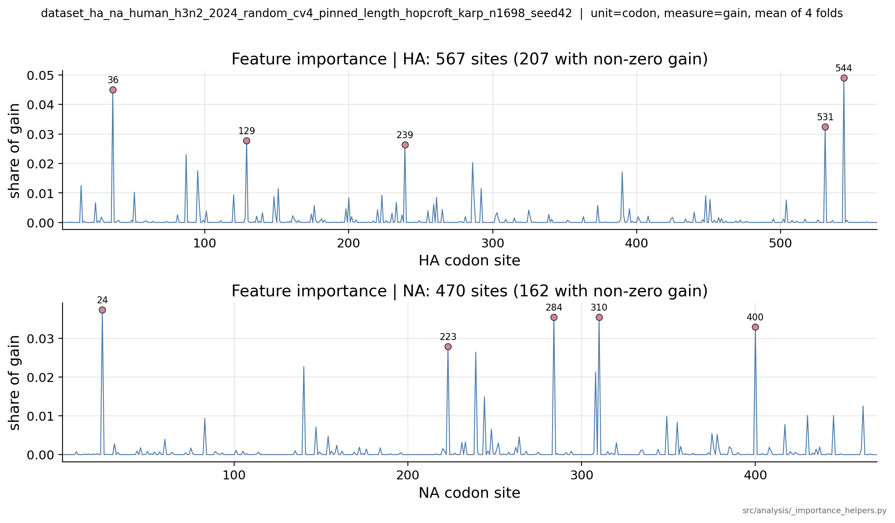
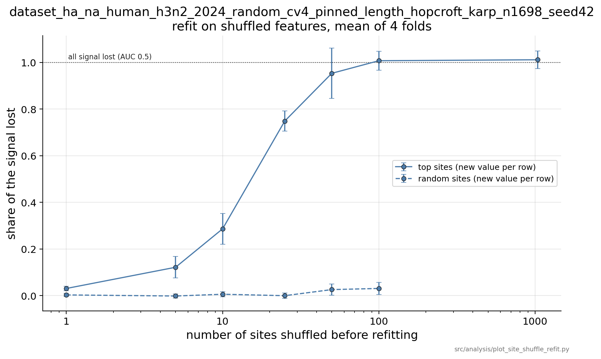

# Segment matching: progress report and scope decision

**Date:** 2026-09-08

**Research Question.** Given two influenza A gene-segment sequences, can a classifier distinguish an observed same-isolate pair from a generated pair that was not observed together?

(a) **Within-season matching**: Train and test on disjoint pairs from the same year. This represents an established season with existing paired sequences for training.

(b) **One-season-ahead matching**: Train on year T and test on year T+1, without using year T+1 data for model training or fine-tuning. This represents the beginning of a new season, before existing paired sequences are available.

**Purpose of this report.** Summarize the work done on Human-H3N2-2024 and decide a potential scope for publication. The within-season setting (a) has now been tested with unique nucleotide and codon sequences, as well as k-mers. The one-season-ahead setting remains open.

---

## 1. Dataset population

The completed experiments in sections 2 and 3 use the following population.

| Filters | Positives | Used for |
|---|---:|---|
| Human-H3N2-2024; complete CDS at pinned length | 1,698 per schema pair | Four schema pair comparison; feature importance; shuffling and refitting |

The dataset construction enforces that **no nucleotide CDS is used in more than once in retained positive pairs**.
Generating negatives within each fold then gives zero exact sequence overlap between training and
test.

---

## 2. Four schema pairs experiment

Four schema pairs over four proteins, arranged so that each protein appears twice (HA and NA: variable surface proteins; PB2 and PA: conserved polymerase proteins).

|  | PA | NA |
|---|---|---|
| **PB2** | PB2-PA | PB2-NA |
| **HA** | PA-HA | HA-NA |

### Population sizes

Explanation of columns for the table below:
* **Eligible isolates**: isolates satisfying the metadata filters (Human, H3N2, 2024) with both required segments represented by complete CDS sequences at their pinned lengths.
* **Unique positive pairs**: eligible isolates after deduplicating exact pairs of nucleotide sequences (i.e., sequence pair deduplication per schema pair).
* **HK-selected positives**: a maximum-size subset in which each nucleotide sequence occurs in at most one positive pair on each side. Hopcroft–Karp (HK) finds the maximum possible count under this constraint.
* **Min-count sample**: the HK-selected population randomly sampled to 1,698 positives, the smallest HK count across the four schemas. HA–NA already has 1,698 and therefore is not reduced further.

```
                                              PB2-PA
  [ Human, H3N2, 2024 + complete CDS at pinned length ]
                      ↓
  Eligible isolates                            5,324
                      ↓  dedup identical nucleotide sequence pairs
  Unique positive pairs                        3,837
                      ↓  Hopcroft-Karp: each sequence at most once per side
  HK-selected positives                        2,030
                      ↓  sample to the smallest HK count across schemas
  Min-count sampled                            1,698
```

| Schema pair | Eligible isolates | Unique positive pairs | HK-selected positives | Min-count sampled |
|---|---:|---:|---:|---:|
| HA-NA | 5,173 | 3,466 | 1,698 | 1,698 |
| PB2-PA | 5,324 | 3,837 | 2,030 | 1,698 |
| PB2-NA | 5,167 | 3,532 | 1,745 | 1,698 |
| PA-HA | 5,329 | 3,805 | 1,944 | 1,698 |

* HA-NA has the smallest HK-selected count, so it set the min-count sample size of 1,698.

*  Note that while the final positive count is the same across the four schema pairs (the `min-count sampled` of 1,698), the underlying isolates do not necessarily match, because filtering, HK selection, and sampling are each done independently per schema.

### Setup

**Datasets**: Within a schema pair, all four feature representations (k-mers, per-site nucleotides, per-site codon, amino-acids) use the SAME dataset rows and the SAME
CV folds.

**Models**: LightGBM classifier with threshold 0.5, and a 1:1 neg-to-pos ratio.

### Results

The table shows mean ± std across four test folds.

A _"per-site feature"_ in this experiment refers to one feature column for each aligned position of a fixed-length CDS: a nucleotide, codon, or translated amino acid (aa), depending on the feature type.

We avoid the term _"positional encoding"_ because it usually refers to adding positional information to sequence tokens in transformer architectures.

| Schema pair | Feature type | Features | F1 macro | AUC-ROC | Precision | Recall |
|---|---|---:|---:|---:|---:|---:|
| HA-NA | nt 6-mer | 8,192 | 0.8635 ± 0.0158 | 0.9250 ± 0.0113 | 0.8059 | 0.9617 |
| HA-NA | site nt | 3,111 | 0.8713 ± 0.0037 | 0.9358 ± 0.0061 | 0.8199 | 0.9541 |
| HA-NA | site codon | 1,037 | 0.8777 ± 0.0134 | 0.9349 ± 0.0068 | 0.8288 | 0.9541 |
| HA-NA | site aa | 1,037 | 0.7605 ± 0.0116 | 0.8321 ± 0.0175 | 0.7174 | 0.8687 |
|  |  |  |  |  |  |  |
| PB2-PA | nt 6-mer | 8,192 | 0.7673 ± 0.0345 | 0.8642 ± 0.0261 | 0.7183 | 0.8928 |
| PB2-PA | site nt | 4,431 | 0.8300 ± 0.0332 | 0.9093 ± 0.0233 | 0.7818 | 0.9217 |
| PB2-PA | site codon | 1,477 | 0.8122 ± 0.0283 | 0.9036 ± 0.0196 | 0.7598 | 0.9211 |
| PB2-PA | site aa | 1,477 | 0.4526 ± 0.0214 | 0.5263 ± 0.0132 | 0.5028 | 0.7001 |
|  |  |  |  |  |  |  |
| PB2-NA | nt 6-mer | 8,192 | 0.8580 ± 0.0167 | 0.9244 ± 0.0124 | 0.8035 | 0.9517 |
| PB2-NA | site nt | 3,690 | 0.8819 ± 0.0167 | 0.9331 ± 0.0149 | 0.8370 | 0.9505 |
| PB2-NA | site codon | 1,230 | 0.8726 ± 0.0192 | 0.9277 ± 0.0163 | 0.8240 | 0.9505 |
| PB2-NA | site aa | 1,230 | 0.5751 ± 0.0392 | 0.6467 ± 0.0312 | 0.5725 | 0.7850 |
|  |  |  |  |  |  |  |
| PA-HA | nt 6-mer | 8,192 | 0.8113 ± 0.0191 | 0.8979 ± 0.0113 | 0.7581 | 0.9217 |
| PA-HA | site nt | 3,852 | 0.8438 ± 0.0235 | 0.9179 ± 0.0162 | 0.7946 | 0.9323 |
| PA-HA | site codon | 1,284 | 0.8296 ± 0.0177 | 0.9120 ± 0.0166 | 0.7826 | 0.9175 |
| PA-HA | site aa | 1,284 | 0.5353 ± 0.0248 | 0.5591 ± 0.0393 | 0.5337 | 0.6438 |

### What the table shows

* Performance for Human-H3N2-2024 varies across the schema pairs. With per-site nucleotide features, F1 macro ranges: 0.8300 for PB2-PA to 0.8819 for PB2-NA.

* Per-site nucleotides and codons has a higher mean score than 6-mers for every schema pair. `TODO`: need more folds

* Amino-acid (aa) performance is lower and varies by pair. Some schema pairs fall to near-chance. The aa arm likely violates two constraints that the nucleotide and codon arm satisfy: (a) no sequence is reused across pairs, and (b) no negative pair matches a positive pair (label collision). Both criteria were enforced when the dataset was built on nucleotide sequences, and translation collapses synonymous variants, so there is no guarantee either constraint actually carries into aa space. Part of the performance loss with aa therefore likely reflects how the dataset was constructed. `TODO`: For a fair aa experiment, rebuild the dataset using aa sequences for positive-pair deduplication, and negative-pair collision blocking. Report this as a separate population because it cannot use exactly the same rows as the nucleotide experiments.

* Mean precision is significantly below mean recall in all 16 cells. See section 5.

---

## 3. Where the codon-site signal sits

Gain feature importance was computed for all four schema pairs. Each codon position is one feature. Gain is the total reduction in training loss from tree splits using that feature (higher reduction -> more important feature). Gain was normalized within each fold and then averaged across the four folds.

For HA-NA, three barplots are shown. Left: gain feature importance; Middle: SHAP values; Right: permutation importance (test set features shuffled before prediction).



| Schema pair | Gain by protein | Gain in top 25 sites |
|---|---:|---:|
| HA-NA | HA 55.5%; NA 44.5% | 59.1% |
| PB2-PA | PB2 50.8%; PA 49.2% | 50.1% |
| PB2-NA | PB2 52.9%; NA 47.1% | 60.8% |
| PA-HA | PA 42.5%; HA 57.5% | 46.2% |

Both sides contribute in every schema pair, and a relatively small set of sites carries much of
the total gain.

The HA-NA gain trace illustrates how the important sites are distributed along both proteins.



### HA-NA shuffle and refit

For HA-NA, site codon features were ranked by gain. The selected values were shuffled across pair rows in the training, validation, and test splits, and the model was then re-trained. The ranking was averaged across all folds. Results are reported as the fraction of above-chance AUC-ROC lost:

`(baseline AUC - refit AUC) / (baseline AUC - 0.5)`

| Sites shuffled | Top-ranked sites | Random sites |
|---:|---:|---:|
| 10 | 0.287 | 0.006 |
| 25 | 0.749 | 0.000 |
| 50 | 0.954 | 0.026 |
| 100 | 1.008 | 0.031 |

* Shuffling the top 10 sites, and then refitting recovers most of the above-chance performance.
* Shuffling the top 50 sites, and then refitting removes 95.4% of above-chance AUC-ROC.
* Shuffling 100 random sites, and then refitting removes only 3.1%.



---

## 4. Open question 1. One-season-ahead matching.

Can a classifier trained on Human-H3N2-2024 sequences make accurate prediction on Human-H3N2-2025?

* Build the 2024 and 2025 populations using the same complete-CDS, pinned-length, and sequence-deduplication protocol used in the within-season experiment.
* Remove exact sequence overlap between years.
* Generate negatives within each year, and use only 2024 data for model training.
* Evaluate the final model on 2025.
* Compare this result with a size-matched within-2024 experiment to measure the effect of transferring
to a new season.
* Use k-mers, per-site nucleotide, and per-site codon.

---

## 5. Open question 2. Error analysis. Why is precision much lower than recall?

* At the default threshold of 0.5, mean precision is consistently lower than mean recall for all configurations.
* Determine whether this is primarily an operating-threshold effect or has another cause.
* Test whether precision can be improved beyond adjusting the threshold.

The precision-recall imbalance directly relates to the intended application of the segment-matching model.

---

## Summary

* Within-season matching achieves F1 macro scores from 0.83 to 0.88 across four schema pairs after enforcing nucleotide-sequence uniqueness on both sides.
* Performance depends on both the schema pair and the feature representation. Nucleotide and codon features remain strong, while amino-acid performance drops sharply for some pairs.
* Top-ranked positions matter, but a retrained model can recover from corrupting a small number of them by using other positions.

---

## Artifacts

Datasets `data/datasets/flu/July_2025/runs/dataset_{ha_na,pb2_pa,pb2_na,pa_ha}_human_h3n2_2024_random_cv4_pinned_length_hopcroft_karp_n1698_seed42`.
Models under `models/flu/July_2025/runs/` with `human_h3n2_2024_n1698_seed42` in their names.
Codon-site importance maps are under
`results/flu/July_2025/dataset_{ha_na,pb2_pa,pb2_na,pa_ha}_human_h3n2_2024_random_cv4_pinned_length_hopcroft_karp_n1698_seed42/site_importance/`.
The committed figures embedded in section 3 are
`figs/2026-09-08_ha_na_codon_importance_barplot.png`,
`figs/2026-09-08_ha_na_codon_gain_trace.png`, and
`figs/2026-09-08_ha_na_codon_shuffle_refit_gain.png`.
Method detail in `docs/plans/2026-08-28_per_site_nt_features_plan.md`, capacity in
`docs/results/2026-09-08_cds_pair_capacity.md`, population definition in
`docs/results/2026-09-07_cds_length_survey.md`.
