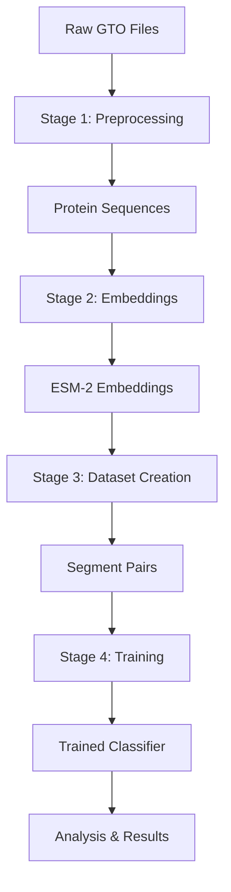

# Pipeline Overview

The viral-segmatch project implements a 4-stage machine learning pipeline for viral protein segment classification.

**Note**: For detailed technical documentation and research results, see [`../docs/`](../docs/).

## 🔄 Pipeline Stages



### Stage 1: Preprocessing
- **Input**: Raw GTO files with viral protein data
- **Process**: Extract protein sequences, filter by function
- **Output**: `protein_final.csv` with clean protein data
- **Script**: `scripts/preprocess_*_protein.sh`
- **Location**: `data/processed/{virus}/{data_version}/` (shared across experiments)

### Stage 2: Embeddings
- **Input**: Protein sequences from preprocessing
- **Process**: Generate ESM-2 embeddings for each protein
- **Output**: Master embeddings cache (`master_esm2_embeddings.h5` + `.parquet`)
- **Script**: `scripts/stage2_esm2.sh`
- **Location**: `data/embeddings/{virus}/{data_version}/` (shared across experiments)

### Stage 3: Dataset Creation
- **Input**: ESM-2 embeddings + protein metadata
- **Process**: Create segment pairs (same/different isolate) with co-occurrence blocking
- **Output**: Training/validation/test datasets
- **Script**: `scripts/stage3_dataset.sh`
- **Location**: `data/datasets/{virus}/{data_version}/runs/dataset_{bundle}_{timestamp}/` (experiment-specific)

### Stage 4: Training
- **Input**: Segment pair datasets
- **Process**: Train ESM-2 frozen classifier
- **Output**: Trained model + predictions + analysis
- **Script**: `scripts/stage4_train.sh`
- **Location**: `models/{virus}/{data_version}/runs/training_{bundle}_{timestamp}/` (experiment-specific)

## 📊 Data Flow

### Data Sampling Strategy
- **File-level sampling**: `max_files_to_process` (preprocessing stage, optional)
- **Isolate-level sampling**: `max_isolates_to_process` (downstream stages)

### Path Structure
```
data/
├── raw/                          # Original GTO files
├── processed/
│   └── {virus}/
│       └── {data_version}/       # Preprocessed data (shared)
├── embeddings/
│   └── {virus}/
│       └── {data_version}/       # ESM-2 embeddings (shared, master cache)
│           ├── master_esm2_embeddings.h5
│           └── master_esm2_embeddings.parquet
├── datasets/
│   └── {virus}/
│       └── {data_version}/
│           └── runs/             # Experiment-specific datasets
│               └── dataset_{bundle}_{timestamp}/
└── models/
    └── {virus}/
        └── {data_version}/
            └── runs/             # Experiment-specific models
                └── training_{bundle}_{timestamp}/
```

**Key Principle**: Preprocessing and embeddings are **shared** per virus/data_version. Datasets and models are **experiment-specific** in `runs/` subdirectories with config bundle names.

## ⚙️ Configuration System

### Hydra Bundles
- **`bunya`**: Bunyavirus configuration
- **`flu_ha_na_5ks`**: Flu, HA-NA only (variable segments), 5K isolates
- **`flu_pb2_pb1_pa_5ks`**: Flu, PB2-PB1-PA only (conserved segments), 5K isolates
- **`flu_pb2_ha_na_5ks`**: Flu, PB2-HA-NA (mixed), 5K isolates
- **Custom**: Create new bundles in `conf/bundles/`

*For detailed configuration guide, see [`../docs/CONFIGURATION_GUIDE.md`](../docs/CONFIGURATION_GUIDE.md)*

### Key Parameters
- `max_isolates_to_process`: Controls dataset size (null = full dataset)
- `master_seed`: Ensures reproducibility
- `selected_functions`: Protein types to include
- `allow_same_func_negatives`: Control same-function negative pairs

## 🚀 Running Experiments

### Quick Start
```bash
# Stage 2: Compute embeddings (if not already done)
./scripts/stage2_esm2.sh flu --cuda_name cuda:7

# Stage 3: Create dataset
./scripts/stage3_dataset.sh flu_ha_na_5ks

# Find the dataset directory
ls -lt data/datasets/flu/July_2025/runs/ | head -3

# Stage 4: Train model
./scripts/stage4_train.sh flu_ha_na_5ks --cuda_name cuda:7 \
    --dataset_dir data/datasets/flu/July_2025/runs/dataset_flu_ha_na_5ks_YYYYMMDD_HHMMSS
```

### Individual Stages
```bash
# Just embeddings
./scripts/stage2_esm2.sh flu --cuda_name cuda:7

# Just dataset creation
./scripts/stage3_dataset.sh flu_ha_na_5ks

# Just training (after finding dataset directory)
./scripts/stage4_train.sh flu_ha_na_5ks --cuda_name cuda:7 \
    --dataset_dir data/datasets/flu/July_2025/runs/dataset_flu_ha_na_5ks_YYYYMMDD_HHMMSS
```

## 📈 Analysis & Results

### Analysis Scripts
- **`src/analysis/analyze_stage4_train.py`**: Comprehensive analysis with metrics and plots
- **`src/analysis/create_presentation_plots.py`**: Publication-ready visualizations

### Output Files
- **Metrics**: `metrics.csv`, `confusion_matrix.csv`, `training_history.csv`
- **Plots**: Confusion matrices, ROC curves, learning curves, error analysis
- **Data**: Detailed FP/FN analysis, confidence distributions

### Output Locations
```
results/{virus}/{data_version}/{config_bundle}/
├── training_analysis/          # Comprehensive analysis
│   ├── confusion_matrix.png
│   ├── roc_curve.png
│   ├── metrics.csv
│   └── ...
└── presentation_plots/         # Publication-ready plots
    ├── performance_summary.png
    └── biological_insights.png
```

## 🔧 Customization

### Adding New Viruses
1. Create new bundle in `conf/bundles/`
2. Add preprocessing script (if needed)
3. Update path utilities if needed

### Modifying Experiments
1. Edit YAML configuration files
2. Adjust sampling parameters
3. Run individual stages as needed

## 📝 Best Practices

### Reproducibility
- Always use `master_seed` for consistent results
- Document configuration changes
- Save experiment logs (automatically saved to `logs/`)

### Performance
- Use GPU for embeddings and training
- Monitor disk space for large datasets
- Consider sampling for initial experiments

### Debugging
- Check logs in `logs/` directory
- Verify intermediate outputs
- Use smaller datasets for testing

## 📚 Related Documentation

- **[Configuration Guide](../docs/CONFIGURATION_GUIDE.md)** - Detailed configuration documentation
- **[Experiment Results](../docs/EXPERIMENT_RESULTS_ANALYSIS.md)** - Current experiment results
- **[Project Status](../docs/EXP_RESULTS_STATUS.md)** - Research status and roadmap
- **[Quick Start](quick-start.md)** - Get started quickly
